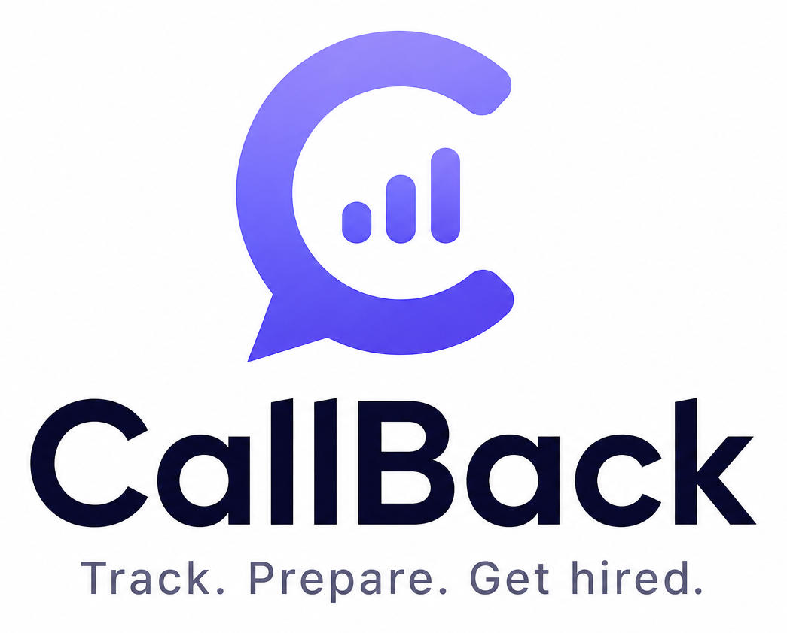

  

<h1 align="center">CallBack — Interview Tracker</h1>

A single-file, offline-friendly app to run your whole job search in one place: companies,
rounds, interviewers, comp, notes — plus **AI** that turns a pasted job link or email into an
entry, drafts your prep and thank-you notes, and answers questions about your pipeline.

No build step, no dependencies, no accounts. Your data lives in your browser (with JSON
export/import for backup, and optional cloud sync to a database you own).

## Use it
Open `index.html` — that's it. Hosted via GitHub Pages, then **Add to Home Screen** on mobile
for a full-screen, installable app (works offline).

## Features
- **Smart add** — paste a job-posting URL, recruiter email, calendar invite or profile and AI
  fills a reviewable entry. Upload a PDF and it reads it directly.
- **Cards** — a glanceable grid of every role: logo, stage, next call, salary, contacts.
- **Pipeline** — drag-and-drop Kanban by interview stage.
- **Upcoming** — calendar/timeline of interviews, tasks and offer deadlines.
- **Insights + Ask AI** — what converts, comp in play, and a pipeline-aware assistant that
  knows your roles and résumé.
- **AI prep** — one-tap interview briefs, smart questions to ask, a tailored intro, and a
  thank-you note for every round.
- **Company brief** — auto company logo + a quick pre-call brief so you never mix up who's who.
- **Résumé Studio** — upload your résumé (PDF read natively), edit it in structured sections,
  and export a clean PDF.
- **Offer scorecard** — a weighted decision matrix across competing offers.

## AI engine
Defaults to **Google Gemini** (free tier) for the widest, zero-cost reach. Add a free key in
Settings → AI engine, host your key server-side with the optional Supabase proxy, use a Claude
key, or fall back to copy-paste with any chatbot — no key required.

## Cloud sync
Settings (⚙) → **Cloud sync** connects to a free Supabase project so your phone and computer
stay in sync via a private code. Optional — local-only by default.

## Backup
Settings (⚙) → **Export backup** saves a JSON snapshot. Import it on any device to restore.

## iOS App Store
See [APP_STORE.md](APP_STORE.md) for the Capacitor packaging + submission runbook, and
[NATIVE.md](NATIVE.md) for the native power-ups (share sheet, calendar, contacts, reminders).
[privacy.html](privacy.html) is the hostable privacy policy for App Store Connect.
