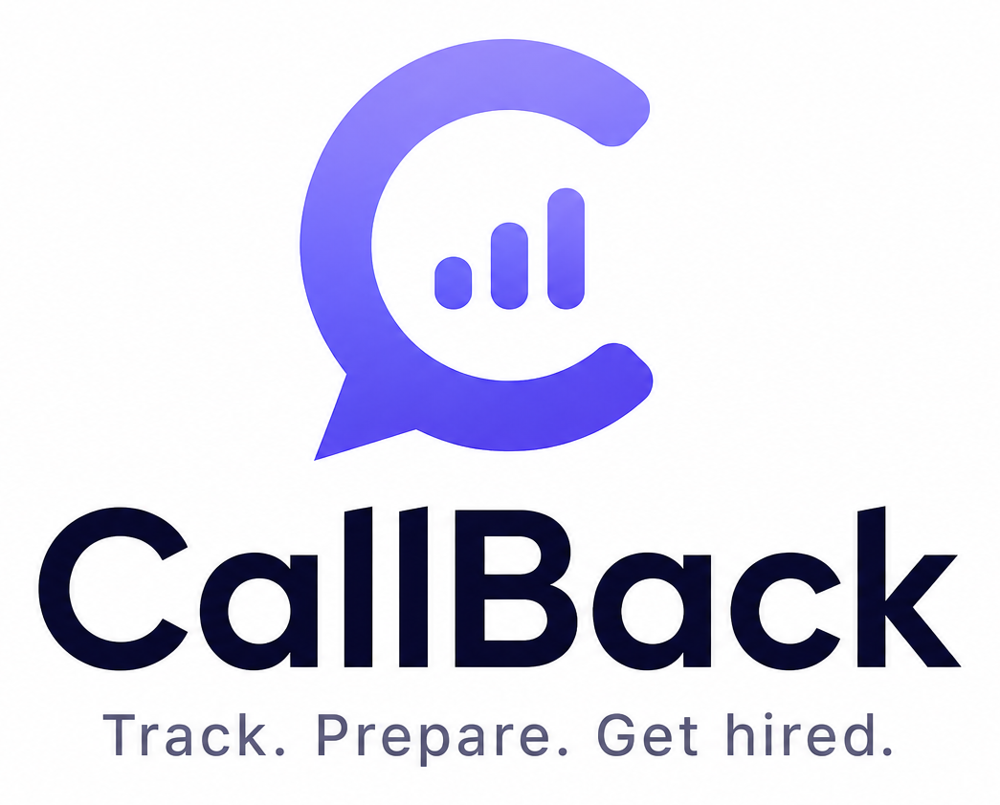

  

<h1 align="center">Meanwhile</h1>

<i>From getting hired to knowing how the company works.</i>

A single-file, offline-friendly app that follows you through the whole thing.

**Before the job** — find it, research it, prepare for it: companies, rounds, interviewers, comp,
notes, plus **AI** that turns a pasted job link or email into an entry, drafts your prep and
thank-you notes, and answers questions about your pipeline.

**After the job** — understand it, navigate it, remember it. Mark a role *I got the job* and the
same company and people you built while interviewing become your map of the place: 90-day mode,
one-tap capture of what just happened, and answers about who to ask and why things work the way
they do — each one citing the note you learned it from.

No build step, no dependencies, no accounts.

## Where your data lives
Everything is stored **in your browser**, on your device — no account, no server of ours, nothing
sent anywhere you didn't choose. That also means it can be deleted: clearing your browsing data
takes it with it, and iPhone Safari clears storage for sites you haven't opened in a week unless
the app is on your home screen. Attachments are kept in the browser's file store (IndexedDB) so
big PDFs don't crowd out everything else.

So pick a safety net:
- **Cloud sync** (Settings → Cloud sync) keeps a copy in a free Supabase project **you** own and
  control, and keeps your phone and laptop in step. This is the recommended one.
- **Export backup** writes a complete JSON file — attachments included — that you can keep in
  iCloud Drive or anywhere else and import on any device.

Meanwhile tells you when neither is in place rather than letting you find out the hard way.

## Use it
Open `index.html` — that's it. Hosted via GitHub Pages, then **Add to Home Screen** on mobile
for a full-screen, installable app (works offline).

## Features
- **Smart add** — paste a job-posting URL, recruiter email, calendar invite or profile and AI
  fills a reviewable entry. Upload a PDF and it reads it directly.
- **Cards** — a glanceable grid of every role: logo, stage, next call, salary, contacts.
- **Pipeline** — drag-and-drop Kanban by interview stage.
- **Upcoming** — calendar/timeline of interviews, tasks and offer deadlines.
- **Insights + Ask AI** — what converts, comp in play, and a pipeline-aware assistant that
  knows your roles and résumé.
- **AI prep** — one-tap interview briefs, smart questions to ask, a tailored intro, and a
  thank-you note for every round.
- **Company brief** — auto company logo + a quick pre-call brief so you never mix up who's who.
- **Résumé Studio** — upload your résumé (PDF read natively), edit it in structured sections,
  and export a clean PDF.
- **Offer scorecard** — a weighted decision matrix across competing offers.

### After you're hired
- **I got the job** — one button turns the role you interviewed for into your employer. Nothing is
  duplicated and nothing is lost: the people you met are already your colleagues.
- **90-day mode** — day *N* of 90, with everything you've learned about the place in one command
  center. It doesn't expire; on day 91 it just becomes *My Company*.
- **Capture** — say or type what happened ("Met Mike, he owns Salesforce reporting, Finance doesn't
  trust the forecast"). AI pulls out the people, systems, projects, problems and open questions,
  shows you what it found, and files it. You capture once; it does the bookkeeping.
- **Who do I ask?** — describe what you're stuck on and get ranked people *with the evidence*: what
  they own, what they know, which of your notes back it up.
- **What am I missing?** — gaps worked out from your own records: systems with no owner, projects
  with no lead, departments you depend on but have never met.
- **Ask Meanwhile** — questions about your company answered from your notes, with every claim
  linked back to where you recorded it. It says "you haven't recorded that" instead of guessing.
- **30 / 60 / 90-day reviews** — what you learned, who you know, what's still fuzzy.
- **Prep for a meeting** — pick who you're seeing and get what you know about them, what you have in
  common, and what's still unresolved. No calendar connection required.
- **What changed** — a diff of your company map over the past week, month or quarter.
- **The map** — people, departments and systems as a visual graph, plus a career timeline that runs
  from the day you found the job to last week's meeting.

## AI engine — bring your own
Meanwhile is **bring-your-own-AI**: plug in your own **Gemini** (free tier), **ChatGPT (OpenAI)**,
or **Claude (Anthropic)** key in Settings → AI engine, and it calls that provider directly — your
data goes only to the AI you chose, at your cost (Gemini is free). No key? It falls back to
copy-paste with any chatbot. You can also host a key server-side via the optional Supabase proxy.

## Cloud sync
Settings (⚙) → **Cloud sync** connects to a free Supabase project so your phone and computer
stay in sync via a private code. Optional — local-only by default.

## Backup
Settings (⚙) → **Export backup** saves a JSON snapshot. Import it on any device to restore.

## iOS App Store
See [APP_STORE.md](APP_STORE.md) for the Capacitor packaging + submission runbook, and
[NATIVE.md](NATIVE.md) for the native power-ups (share sheet, calendar, contacts, reminders).
[privacy.html](privacy.html) is the hostable privacy policy for App Store Connect.
